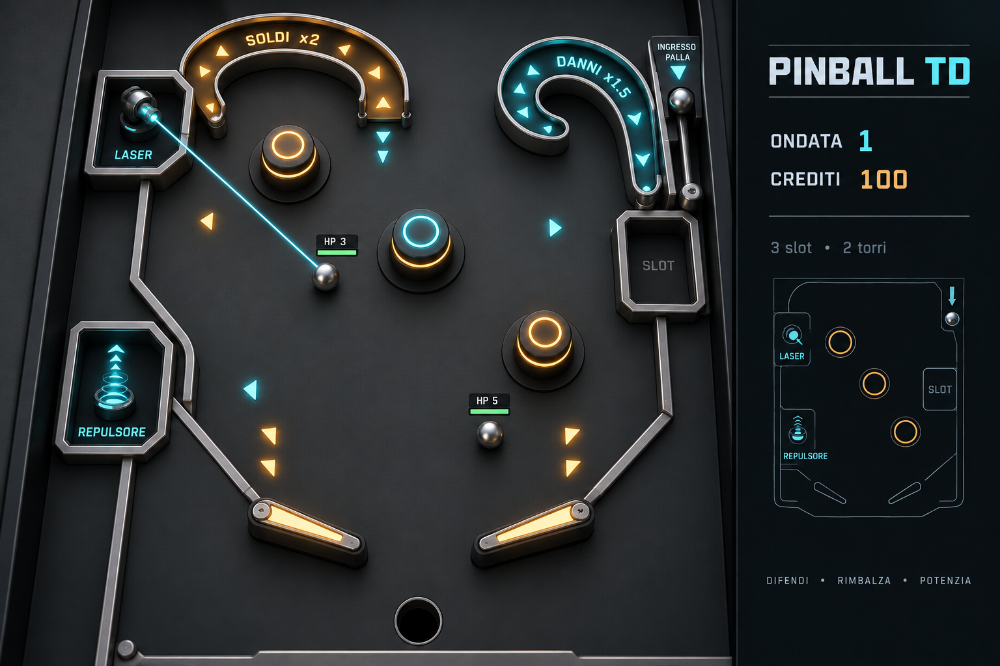

# Pinball TD — Concept e game design

Design del prototipo iniziale. Le regole confermate sono distinte dai valori provvisori da provare e dalla coppia di torri concordata. Non specifica una tecnologia di implementazione.

## Concept

Un pinball tower defense endless a ondate, con un tavolo astratto senza ambientazione specifica. Il giocatore controlla due flipper e costruisce un sistema di torri che danneggia le palline o aiuta a mantenerle in gioco.

Le palline hanno punti vita: bisogna distruggerle tutte prima che una raggiunga lo scarico centrale. Una sola pallina persa termina immediatamente la partita.

Il tavolo usa superfici semplici e forme geometriche, con colori ed effetti che rendono leggibili gli elementi di gioco. Le palline restano esteticamente palline, senza rappresentare nemici figurativi.

Il gioco sarà in 3D, con visuale fissa frontale rialzata e inclinata, simile a 3D Pinball Space Cadet: flipper in primo piano e parte alta del tavolo in profondità.



Concept visivo iniziale, non una schermata del prototipo implementato. Generato con il tool integrato imagegen. Prompt: tavolo 3D astratto con superficie neutra e forme geometriche semplici, visuale come Space Cadet, layout asimmetrico con tre bumper, tre slot esterni alle traiettorie, Laser in alto a sinistra, Repulsore in basso a sinistra, slot libero a destra, due canalette bonus, due flipper e unico scarico centrale. La geometria e il livello di dettaglio saranno adattati nel prototipo.

## Regole confermate

- Due flipper controllati dal giocatore.
- Un solo scarico, centrale, sotto i flipper. Nessuno scarico laterale.
- Le palline entrano gradualmente, ma rapidamente, durante ogni ondata.
- Ogni pallina ha punti vita e viene distrutta quando questi raggiungono zero.
- Le palline non collidono tra loro.
- I bumper infliggono danno, senza generare direttamente valuta.
- Le torri offensive infliggono danno; le torri di supporto aiutano a mantenere le palline in gioco.
- Le torri occupano zone che non interferiscono fisicamente con i percorsi delle palline.
- Distruggere una pallina assegna valuta.
- Esiste una sola valuta, usata per costruzione e potenziamenti.
- Le torri si costruiscono in slot prestabiliti e possono essere potenziate e vendute.
- Durante le ondate non si spendono risorse.
- La costruzione e la gestione delle torri avvengono tra un’ondata e la successiva.
- Il punteggio è l’ondata raggiunta.
- La difficoltà cresce aumentando numero e punti vita delle palline.
- Il layout è asimmetrico.

## Ciclo della partita

1. Preparazione: il giocatore gestisce le torri negli slot disponibili.
2. Avvio dell’ondata: le palline vengono introdotte in rapida successione.
3. Combattimento: flipper, bumper e torri mantengono le palline in movimento e ne riducono i punti vita.
4. Percorsi bonus: attraversare le canalette attiva moltiplicatori globali.
5. Ricompense: ogni pallina distrutta assegna valuta, modificata dall’eventuale bonus soldi attivo.
6. Fine dell’ondata: dopo che tutte le palline previste sono entrate e sono state distrutte, si torna alla preparazione.
7. Progressione: l’ondata successiva aumenta il carico sul tavolo.

In qualsiasi momento, una pallina che cade nello scarico centrale causa game over immediato.

## Economia e moltiplicatori

La valuta si ottiene distruggendo le palline. Colpire i bumper produce soltanto danno. La vendita delle torri è consentita tra le ondate; nel prototipo restituisce il 50% della spesa totale, arrotondato per difetto.

Esistono due categorie di moltiplicatore:

| Moltiplicatore | Effetto globale |
| --- | --- |
| Danni | Aumenta i danni inflitti alle palline. |
| Bonus soldi | Aumenta la valuta ricevuta quando una pallina viene distrutta. |

I bonus non appartengono alla singola pallina che attraversa la canaletta. Il bonus soldi si applica a tutti i guadagni mentre è attivo.

Le canalette hanno difficoltà di accesso differenti. Per il prototipo, i bonus durano 6 secondi di combattimento: un nuovo passaggio rinnova la durata senza sommare il valore. Danni e soldi possono essere attivi contemporaneamente. Entrambi si azzerano a fine ondata. Il bonus danni si applica a bumper e torri offensive; non modifica le spinte delle torri di supporto.

## Torri

Due famiglie di strutture:

- Offensive: contribuiscono a distruggere le palline.
- Di supporto: contribuiscono a mantenerle in gioco e a controllarne il movimento.

Gli slot sono esterni alle corsie percorribili. Le torri non aggiungono ostacoli fisici al tavolo; eventuali effetti sul movimento fanno parte della loro funzione.

La coppia confermata per il prototipo è Laser + Repulsore, descritta sotto. I valori numerici sono iniziali e potranno essere regolati durante le prove.

## Proposta iniziale di layout

Questa sezione è una proposta da validare, non un layout già approvato.

Tavolo verticale e asimmetrico: la parte bassa concentra il controllo con i flipper, il centro ospita i bumper e la parte alta contiene ingressi e percorsi bonus. Le pareti laterali guidano le palline verso i flipper senza scarichi aggiuntivi.

```text
┌─────────────────────────────────────┐
│ CANALETTA A                 INGRESSO │
│ accesso più ampio              ↓     │
│       ╲                  ╭──────╮    │
│        ╲                 │  B   │    │
│ [T1]    ● bumper         │stretta    │
│                          ╰──╮──╯    │
│            ● bumper         │ [T2]  │
│                             ↓       │
│ [T3]              ● bumper          │
│                                     │
│     ╲                         ╱     │
│      ╲   FLIPPER   FLIPPER   ╱       │
│             ╲     ╱                 │
│              SCARICO                │
└─────────────────────────────────────┘
```

Schema concettuale, non in scala. Per il prototipo si scelgono tre slot in nicchie esterne all’area percorribile: T1 in alto a sinistra, T2 a metà del lato destro e T3 in basso a sinistra. Ogni slot accetta entrambi i tipi di torre. A è il percorso più accessibile e attiva il bonus soldi; B è più stretto e attiva il bonus danni. Le posizioni precise restano da provare con la fisica.

### Obiettivi del layout

- Rendere leggibile il percorso verso l’unico scarico.
- Offrire traiettorie differenti sui due lati del tavolo.
- Consentire tiri intenzionali verso bumper e canalette.
- Rendere alcune canalette più impegnative da imboccare.
- Mostrare chiaramente l’effetto delle torri senza ostacolare la visibilità delle palline.
- Garantire che l’ingresso delle palline offra al giocatore una possibilità concreta di reagire.

Posizione dei bumper, geometria delle canalette, traiettorie di ritorno e posizione degli slot devono essere provate attraverso un prototipo fisico del tavolo.

## Punteggio e progressione

La partita continua senza un’ondata finale. Il record corrisponde all’ondata raggiunta, anche se non completata.

Per ora la progressione modifica soltanto:

- Numero di palline per ondata.
- Punti vita delle palline.

Velocità, dimensioni e varianti di palline non fanno parte delle decisioni attuali. Valori iniziali e curve di crescita restano da stabilire.

## Power-up

Il bumper speciale e i power-up sono esclusi dal prototipo per ora.

## Obiettivo del prototipo

- Un tavolo asimmetrico con due flipper e un solo scarico centrale.
- Palline con punti vita, senza collisioni reciproche.
- Ondate con ingresso rapido e graduale.
- Bumper che infliggono danno.
- Una torre offensiva e una torre di supporto in slot prestabiliti.
- Valuta ottenuta dalle palline distrutte.
- Costruzione, potenziamento e vendita tra le ondate.
- Due percorsi per provare i moltiplicatori di danno e soldi.
- Game over alla prima pallina persa e record dell’ondata raggiunta.

Il primo obiettivo è provare la fisica del tavolo, la gestione di più palline e l’utilità delle due torri. Grafica astratta ed essenziale; nessun contenuto aggiuntivo prima di verificare questo ciclo.

## Valori iniziali del prototipo

Sono scelte di partenza delegate per il prototipo, modificabili dopo le prime prove; non rappresentano un bilanciamento definitivo. Distanze e velocità sono espresse rispetto alla larghezza interna del tavolo (W), così non dipendono dalla risoluzione.

| Elemento | Valore iniziale |
| --- | --- |
| Valuta iniziale | 100 crediti |
| Ricompensa per pallina | 10 crediti |
| Vendita | 50% della spesa totale, per difetto |
| Canaletta A, più accessibile | Soldi ×2 per 6 secondi |
| Canaletta B, più difficile | Danni ×1,5 per 6 secondi |
| Bumper | 5 danni a impatto; minimo 0,15 s tra danni dello stesso bumper alla stessa pallina |
| Bumper sul tavolo | 3, disposti in modo asimmetrico come nello schema |
| Diametro pallina | 0,035 W |
| Gravità | 1,2 W/s² verso il basso |
| Restituzione pareti | 0,8 |
| Restituzione bumper | 1,1, con limite di velocità |
| Velocità massima pallina | 2 W/s |
| Flipper | Rotazione di circa 50° in 0,08 s; ritorno in 0,12 s |
| Ingresso | In alto a destra, velocità iniziale 0,6 W/s diretta verso il centro |
| Palline nell’ondata n | 3 + (n − 1) |
| HP per pallina nell’ondata n | 20 + 5 × (n − 1) |
| Intervallo tra ingressi | 0,8 s, costante |

L’ondata 1 contiene quindi 3 palline da 20 HP; l’ondata 2 ne contiene 4 da 25 HP. Il primo ingresso avviene 1 secondo dopo l’avvio. Tra le ondate non esiste un conto alla rovescia: il giocatore avvia la successiva quando ha finito di costruire.

Le pareti inferiori convergono sui flipper. Il varco centrale deve permettere la perdita di una pallina, ma lasciare una possibilità concreta di recupero con un tiro tempestivo. Le canalette devono avere ingresso e uscita riconoscibili; il bonus scatta soltanto attraversando il percorso completo. Geometria e risposta dei flipper hanno priorità rispetto al bilanciamento numerico.

## Due torri confermate

La coppia Laser + Repulsore è stata confermata dal proprietario del progetto. I parametri seguenti sono valori iniziali scelti per il prototipo.

### Laser — offensiva

Una torre che spara un impulso luminoso alla pallina più vicina entro portata. Il colpo è istantaneo e non altera la traiettoria: serve a ridurre gli HP in modo leggibile.

- Costo: 50 crediti.
- Portata: 0,45 W dal centro dello slot; nessun ostacolo alla linea di tiro.
- Livello 1: 4 danni ogni 0,6 s.
- Un solo potenziamento: 40 crediti, porta i danni a 6; portata e frequenza invariate.
- Nessun bersaglio entro portata: resta pronta e non spreca il colpo.

### Repulsore — supporto

Una torre che dà un impulso verso l’alto alla pallina più bassa entro portata, soltanto se sta scendendo. Aiuta il recupero ma non infligge danno e non garantisce di evitare lo scarico. Lo slot basso offre copertura vicino ai flipper; negli altri slot interviene prima nella discesa.

- Costo: 50 crediti.
- Portata: 0,30 W dal centro dello slot.
- Livello 1: aggiunge una velocità di 0,7 W/s verso l’alto, ricarica 3 s.
- Un solo potenziamento: 40 crediti, riduce la ricarica a 2 s; impulso e portata invariati.
- Interviene su una sola pallina per attivazione, rispettando il limite globale di velocità.
- Nessun bersaglio valido: resta pronto. Non recupera palline già entrate nello scarico.

Con 100 crediti iniziali si possono costruire entrambe le torri, oppure due dello stesso tipo. Tre slot lasciano una scelta di posizione e spazio per una terza costruzione nelle ondate successive. Le torri iniziano ogni ondata pronte.

## Verifica del prototipo

- Il giocatore può tenere in gioco una pallina con i flipper e mirare verso la parte alta del tavolo.
- Le palline entrano gradualmente e non collidono tra loro.
- La prima pallina persa causa subito game over, anche con bonus o Repulsore attivi.
- Le due torri hanno effetti riconoscibili e la posizione scelta ne cambia l’utilità.
- I bonus si attivano attraverso le canalette e mostrano il tempo residuo.
- Costruzione, potenziamento e vendita funzionano soltanto tra le ondate.
- L’ondata termina soltanto dopo tutti gli ingressi e la distruzione di tutte le palline.

## Decisioni ancora aperte

1. Scegliere la tecnologia di implementazione e i controlli del prototipo.
2. Provare geometria, ingresso e risposta dei flipper nel prototipo, poi correggere i valori iniziali.

Le scelte numeriche e il layout sopra sono sufficienti come punto di partenza; non richiedono una discussione separata prima di ogni regolazione. La coppia di torri è confermata.
