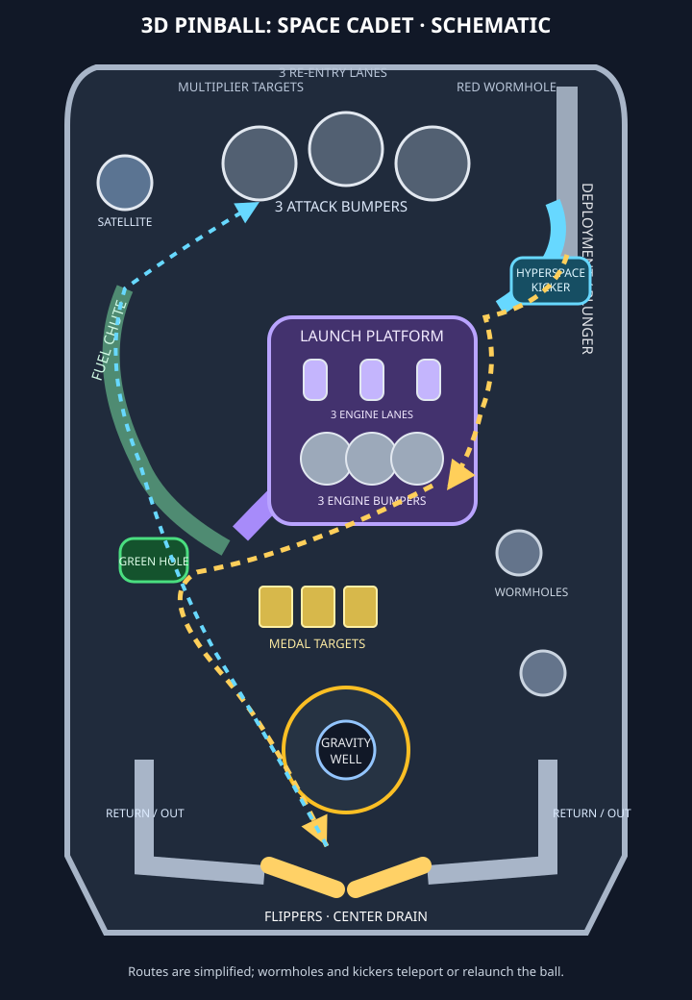
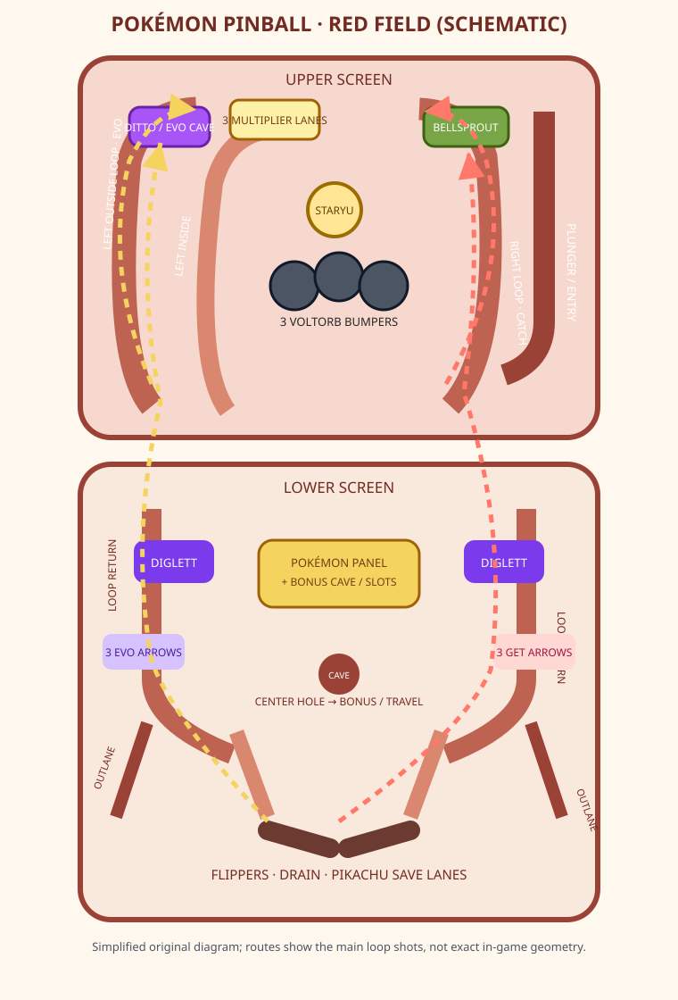
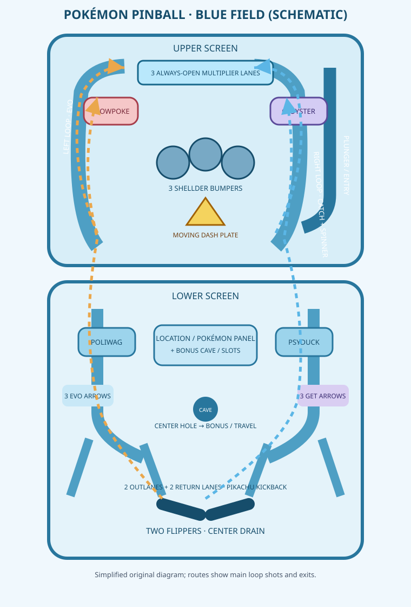

# Reference pinball layouts

These are original, simplified 2D schematics for studying board flow. They are not exact recreations of the games' art or collision geometry; route arrows compress a dynamic, multi-screen playfield into an overview.

## 3D Pinball: Space Cadet

### Elements

- Right-side deployment chute and skill-shot exit into the re-entry area.
- Three attack bumpers at the top, plus the satellite bumper at upper left.
- Three re-entry lanes above the attack bumpers.
- Left fuel chute and the launch ramp leading to the raised launch platform.
- Three engine lanes and three engine bumpers on that platform; leaving it feeds the bonus lane and left flipper.
- Right hyperspace chute and kicker; central and side wormhole kickers connect distant parts of the table.
- Center medal targets, right-side booster targets, and lower-center gravity well.
- Two return lanes, two outlanes with kickers, two flippers, and the drain.

### Main routes

1. **Plunge / re-entry:** launch from the right chute; the ball enters the top re-entry area and drops through one of three re-entry lanes.
2. **Attack loop:** the upper playfield routes shots through the three attack bumpers; the left satellite bumper sits nearby.
3. **Launch-platform loop:** shoot up the left launch ramp to the platform, cross its three engine lanes and bumper group, then leave through the bonus lane to the left flipper.
4. **Fuel loop:** shoot up the curved left fuel chute to roll over fuel lights and return via its flag/upper paths.
5. **Hyperspace loop:** shoot up the upper-right chute into the hyperspace kicker; the chute can feed a re-entry path.
6. **Recovery / drain:** lower return lanes feed the flippers; outlanes may kick the ball back; a center gap or unprotected outlane drains it.
7. **Wormholes:** colored kickers can return the ball locally or send it to another wormhole when opened; they are teleports, not continuous rails.

Source basis: [Space Cadet table components and lanes guide](https://gamefaqs.gamespot.com/pc/563047-3d-pinball-space-cadet/faqs/46514), especially its table overview, chute, lane, kicker, bumper, and target sections.

## Pokémon Pinball (Game Boy Color)

The game has Red and Blue fields. Each is shown as an upper and lower screen area because the original game displays one screen at a time as the ball moves between them.

### Red Field

**Elements:** three Voltorb bumpers at upper center; Ditto and the Evolution Cave at upper left; Bellsprout at upper right; three top multiplier lanes controlled by Staryu; left outside and left inside loops, right loop with spinner; lower Diglett targets; center Pokémon panel / Bonus Cave / slots hole; CAVE lights and mode arrows; side outlanes, return lanes, Pikachu kickback, flippers, and drain.

**Routes:**

1. **Right loop → Catch:** travel up the right loop to light GET arrows; hit Bellsprout to enter Catch mode.
2. **Left outside loop → Evolution:** travel up the left outer loop to light EVO arrows; with all three lit, enter the Evolution Cave after Ditto opens it.
3. **Left inside loop:** an alternate left-side return toward the upper field, useful for directing shots and mode objectives.
4. **Top bumper field:** pass among the three Voltorb; hit Staryu below to open or close the multiplier lanes.
5. **Travel / Bonus Cave:** hit a Diglett three times, complete the indicated loop, then shoot the center hole to change location.
6. **Lower recovery:** return lanes feed the flippers; an outlane can drain unless Pikachu is charged and positioned there.

### Blue Field

**Elements:** three Shellder bumpers at upper center; Slowpoke on the left and Cloyster on the right; a moving directional Dash Plate between them; three always-available multiplier lanes; left and right loops with EVO / GET arrows; right-loop spinner; lower Poliwag and Psyduck targets; center Pokémon panel / Bonus Cave / slots hole; CAVE lights, Pikachu kickback, two outlanes, return lanes, flippers, and drain.

**Routes:**

1. **Left loop → Evolution:** travel up the left loop three times to light EVO, then use the Dash Plate to send the ball left into Slowpoke and start Evolution mode.
2. **Right loop → Catch:** travel up the right loop to light GET arrows; send the ball right into Cloyster to start Catch mode.
3. **Dash Plate → Shellder / multiplier lanes:** when it points upward, it sends the ball into the top Shellder group and multiplier lanes; downward returns to the lower screen.
4. **Travel / Bonus Cave:** hit Poliwag or Psyduck three times, follow the indicated side route through the loop or side target, then enter the center hole.
5. **Right spinner → Pikachu:** right-loop passes spin the charge spinner; a charged Pikachu kickback can rescue a ball from the selected outlane.
6. **Lower recovery:** two inner return lanes feed the flippers, while the outside lanes threaten a drain.

Source basis: [Red Field layout and mechanics](https://bulbapedia.bulbagarden.net/wiki/Red_Field), [Blue Field layout and mechanics](https://bulbapedia.bulbagarden.net/wiki/Blue_Field), and the [Pokémon Pinball overview](https://bulbapedia.bulbagarden.net/wiki/Pokemon_Pinball). The game-specific labels and route conditions are summarized from those references; the positions and route strokes in these diagrams are schematic.
